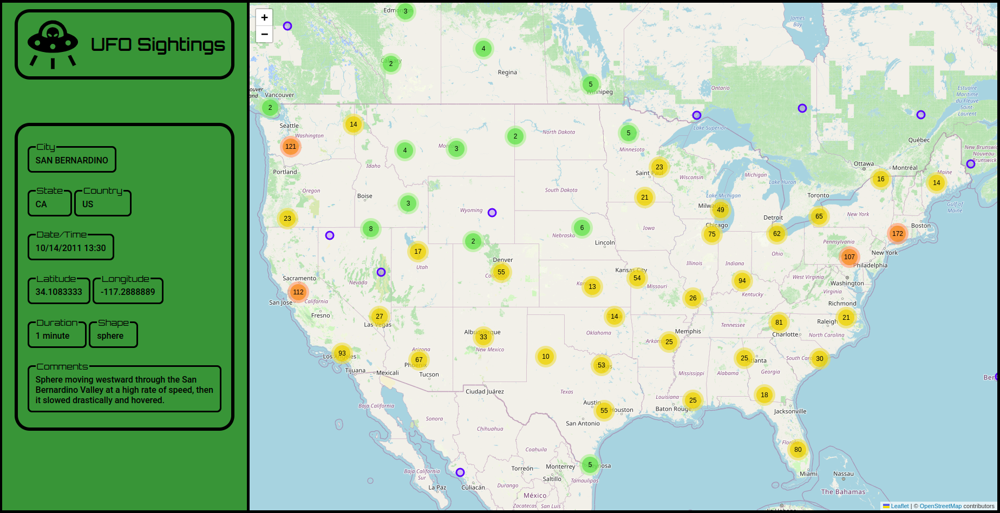

#  UFO Sightings 

This project contains reports about several UFO (Unidentified Flying Object) sightings over the years. 
Click on a marker within the map to find out more about an UFO sighting (Date/Time, Location, Duration, Shape and Comments) or click on a cluster to view all sightings in that region (The number on a cluster indicates how many markers it contains).
 Available [here](https://ufosightings-4b138.web.app/).

Dataset retrieved from [Sigmond Axel](https://www.kaggle.com/datasets/NUFORC/ufo-sightings).

## Technologies
#### Backend
* Language: Python
* Framework: FastAPI
#### Frontend
* Language: TypeScript
* Framework: React

## Installation

Clone the Project:

    git@github.com:LucasGlopes/UFOSightings.git  
    
 Navigate to the project folder:
    
#### Backend
    cd backend/
    docker-compose up --build
    
#### Frontend
    cd frontend/
    npm install
    npm start
